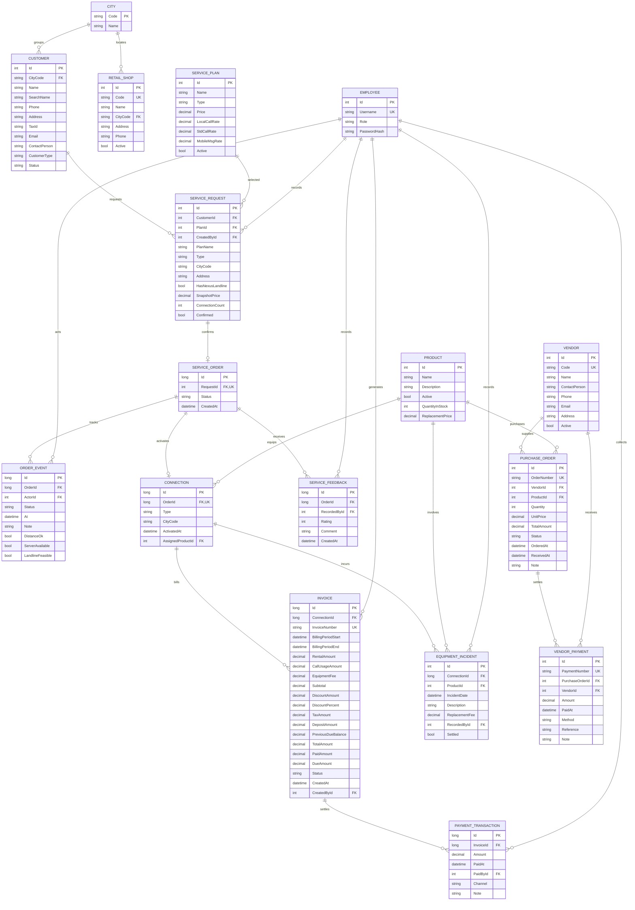

# ERD Nexus Review 1 & Financial Billing Engine & Inventory Management

```mermaid
erDiagram
    CITY ||--o{ CUSTOMER : groups
    CITY ||--o{ RETAIL_SHOP : locates
    CUSTOMER ||--o{ SERVICE_REQUEST : requests
    SERVICE_PLAN ||--o{ SERVICE_REQUEST : selected
    EMPLOYEE ||--o{ SERVICE_REQUEST : records
    SERVICE_REQUEST ||--o| SERVICE_ORDER : confirms
    SERVICE_ORDER ||--o{ ORDER_EVENT : tracks
    EMPLOYEE ||--o{ ORDER_EVENT : acts
    SERVICE_ORDER ||--o| CONNECTION : activates
    PRODUCT ||--o{ CONNECTION : equips
    CONNECTION ||--o{ INVOICE : bills
    CONNECTION ||--o{ EQUIPMENT_INCIDENT : incurs
    PRODUCT ||--o{ EQUIPMENT_INCIDENT : involves
    EMPLOYEE ||--o{ EQUIPMENT_INCIDENT : records
    INVOICE ||--o{ PAYMENT_TRANSACTION : settles
    EMPLOYEE ||--o{ INVOICE : generates
    EMPLOYEE ||--o{ PAYMENT_TRANSACTION : collects
    SERVICE_ORDER ||--o{ SERVICE_FEEDBACK : receives
    EMPLOYEE ||--o{ SERVICE_FEEDBACK : records

    VENDOR ||--o{ PURCHASE_ORDER : supplies
    PRODUCT ||--o{ PURCHASE_ORDER : purchases
    PURCHASE_ORDER ||--o{ VENDOR_PAYMENT : settles
    VENDOR ||--o{ VENDOR_PAYMENT : receives

    CITY {
        string Code PK
        string Name
    }
    RETAIL_SHOP {
        int Id PK
        string Code UK
        string Name
        string CityCode FK
        string Address
        string Phone
        bool Active
    }
    CUSTOMER {
        int Id PK
        string CityCode FK
        string Name
        string SearchName
        string Phone
        string Address
        string TaxId
        string Email
        string ContactPerson
        string CustomerType
        string Status
    }
    EMPLOYEE {
        int Id PK
        string Username UK
        string Role
        string PasswordHash
    }
    SERVICE_PLAN {
        int Id PK
        string Name
        string Type
        decimal Price
        decimal LocalCallRate
        decimal StdCallRate
        decimal MobileMsgRate
        bool Active
    }
    PRODUCT {
        int Id PK
        string Name
        string Description
        bool Active
        int QuantityInStock
        decimal ReplacementPrice
    }
    VENDOR {
        int Id PK
        string Code UK
        string Name
        string ContactPerson
        string Phone
        string Email
        string Address
        bool Active
    }
    PURCHASE_ORDER {
        int Id PK
        string OrderNumber UK
        int VendorId FK
        int ProductId FK
        int Quantity
        decimal UnitPrice
        decimal TotalAmount
        string Status
        datetime OrderedAt
        datetime ReceivedAt
        string Note
    }
    VENDOR_PAYMENT {
        int Id PK
        string PaymentNumber UK
        int PurchaseOrderId FK
        int VendorId FK
        decimal Amount
        datetime PaidAt
        string Method
        string Reference
        string Note
    }
    SERVICE_REQUEST {
        int Id PK
        int CustomerId FK
        int PlanId FK
        int CreatedById FK
        string PlanName
        string Type
        string CityCode
        string Address
        bool HasNexusLandline
        decimal SnapshotPrice
        int ConnectionCount
        bool Confirmed
    }
    SERVICE_ORDER {
        long Id PK
        int RequestId FK,UK
        string Status
        datetime CreatedAt
    }
    ORDER_EVENT {
        long Id PK
        long OrderId FK
        int ActorId FK
        string Status
        datetime At
        string Note
        bool DistanceOk
        bool ServerAvailable
        bool LandlineFeasible
    }
    CONNECTION {
        long Id PK
        long OrderId FK,UK
        string Type
        string CityCode
        datetime ActivatedAt
        int AssignedProductId FK
    }
    EQUIPMENT_INCIDENT {
        int Id PK
        long ConnectionId FK
        int ProductId FK
        datetime IncidentDate
        string Description
        decimal ReplacementFee
        int RecordedById FK
        bool Settled
    }
    INVOICE {
        long Id PK
        long ConnectionId FK
        string InvoiceNumber UK
        datetime BillingPeriodStart
        datetime BillingPeriodEnd
        decimal RentalAmount
        decimal CallUsageAmount
        decimal EquipmentFee
        decimal Subtotal
        decimal DiscountAmount
        decimal DiscountPercent
        decimal TaxAmount
        decimal DepositAmount
        decimal PreviousDueBalance
        decimal TotalAmount
        decimal PaidAmount
        decimal DueAmount
        string Status
        datetime CreatedAt
        int CreatedById FK
    }
    PAYMENT_TRANSACTION {
        long Id PK
        long InvoiceId FK
        decimal Amount
        datetime PaidAt
        int PaidById FK
        string Channel
        string Note
    }
    SERVICE_FEEDBACK {
        long Id PK
        long OrderId FK
        int RecordedById FK
        int Rating
        string Comment
        datetime CreatedAt
    }
```
